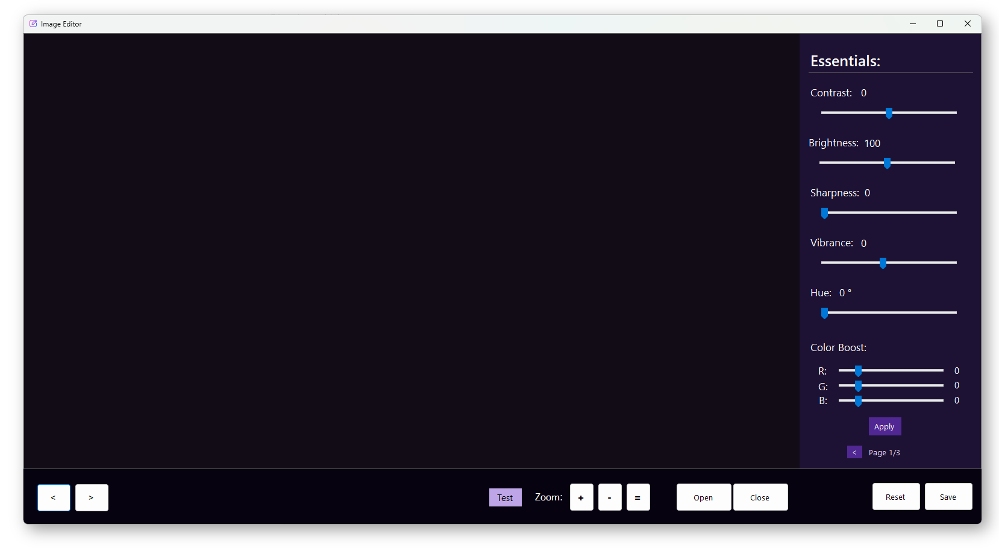

<p align="center">
  
</p>

<p align="center">
  <h1 align="center">Image Editor</h1>
  <p align="center">
    A feature-rich image editor built with C++/CLI and .NET Windows Forms
  </p>
</p>

<p align="center">
  
  
  
  
</p>

<p align="center">
  
</p>


## Overview

A desktop image editing application featuring custom image processing algorithms, AI-powered image generation, and an intuitive user interface. Built entirely from scratch with optimized pixel manipulation using LockBits for fast performance.

## Features

### Image Processing

| Category | Features |
|----------|----------|
| **Essentials** | Contrast, Brightness, Sharpness, Vibrance, Hue, RGB Color Boost |
| **Effects** | Pixelate, Posterize, Blur, Glitch, Exaggerated Glitch |
| **Filters** | Grayscale, Invert, Sepia, Edge Detection, Emboss, Oil Painting |
| **Color Tools** | Color Replacement with threshold and interpolation support |

### AI Image Generation

Generate images using HuggingFace AI models:
- SDXL v1.0
- Stable Diffusion v2.1
- Stable Diffusion v1.5

### Workflow Features

- **Drag & Drop** — Open images or style presets by dropping files onto the window
- **Undo/Redo** — Full history support with up to 10 steps
- **Style Presets** — Save and share your filter configurations as `.iestyle` files
- **Batch Navigation** — Browse through images in a folder seamlessly

## Keyboard Shortcuts

| Shortcut | Action |
|:--------:|--------|
| `Ctrl + O` | Open image |
| `Ctrl + S` | Save image |
| `Ctrl + Z` | Undo |
| `Ctrl + Y` | Redo |
| `Ctrl + R` | Reset to original |
| `Ctrl + E` | Export style preset |
| `Ctrl + I` | Import style preset |
| `Enter` | Apply effects |
| `Esc` | Close image |
| `← / →` | Previous / Next image |
| `+ / -` | Zoom in / out |

## Style Presets

Style presets allow you to save all current filter settings to a shareable file.

**Export:** Adjust filters to your liking → `Ctrl + E` → Enter a name → Save

**Import:** `Ctrl + I` or drag `.iestyle` file onto window → Choose to apply or load settings

Preset files are XML-based and contain all slider values, checkbox states, color replacement settings, and metadata.

## Building from Source

### Requirements

- Windows 10/11
- Visual Studio 2022 with C++/CLI support
- .NET Framework 4.7.2

### Build Steps

1. Clone the repository
   ```
   git clone https://github.com/yourusername/CPP-Image-Editor.git
   ```
2. Open `Image Editor/Image Editor.sln` in Visual Studio
3. Select `x64` platform and `Debug` or `Release` configuration
4. Build the solution (`Ctrl + Shift + B`)

## Configuration

### HuggingFace API Key (Required for AI Generation)

To use the AI image generation feature, you need a free HuggingFace API token:

1. Create a free account at [huggingface.co](https://huggingface.co)
2. Go to **Settings** → **Access Tokens** → **New Token**
3. Create a token with `read` permissions
4. Set it as an environment variable:

**Windows:**
```
1. Press Win + R, type "sysdm.cpl" and press Enter
2. Go to "Advanced" tab → "Environment Variables"
3. Under "User variables", click "New"
4. Variable name: HUGGINGFACE_API_KEY
   Variable value: hf_your_token_here
5. Click OK and restart the application
```

**Or via Command Prompt (temporary):**
```cmd
set HUGGINGFACE_API_KEY=hf_your_token_here
```

**Or via PowerShell (temporary):**
```powershell
$env:HUGGINGFACE_API_KEY="hf_your_token_here"
```

---

<p align="center">
  <sub>Semester Project - Image Editor</sub>
  <br>
  <sub>Spring 2024</sub>
</p>
